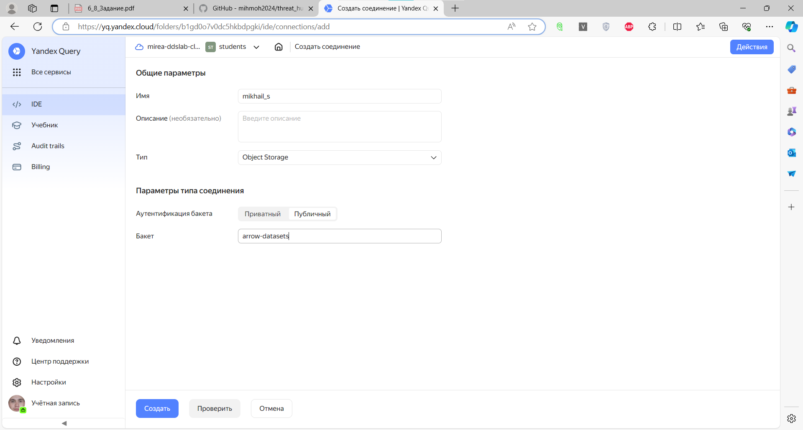
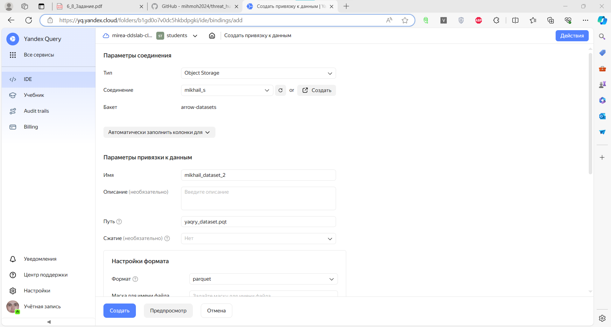
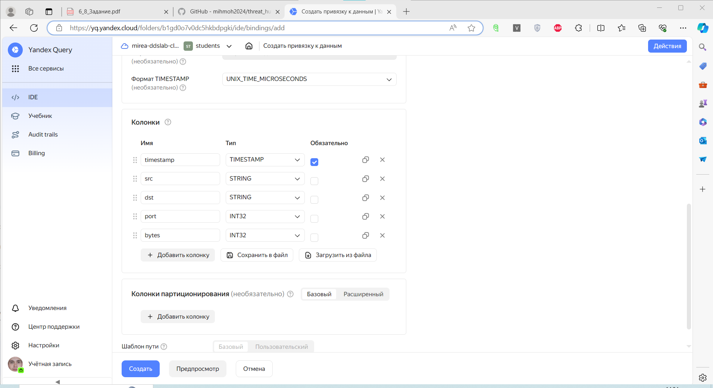
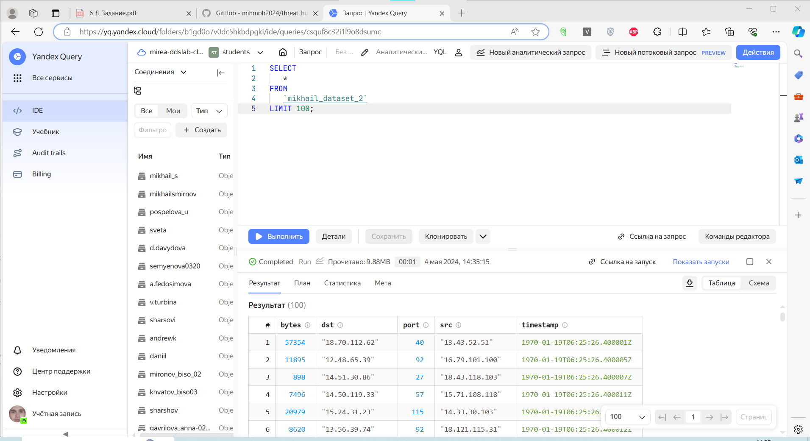
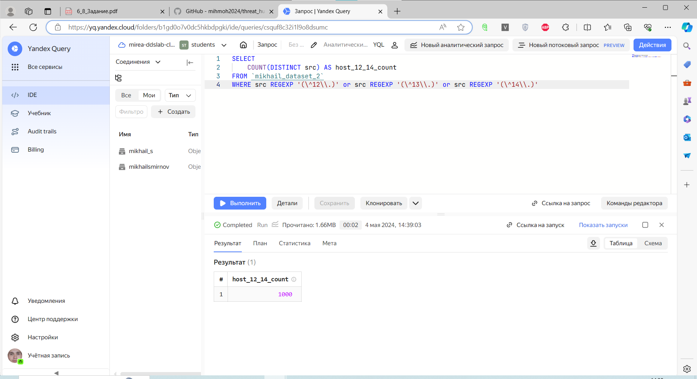
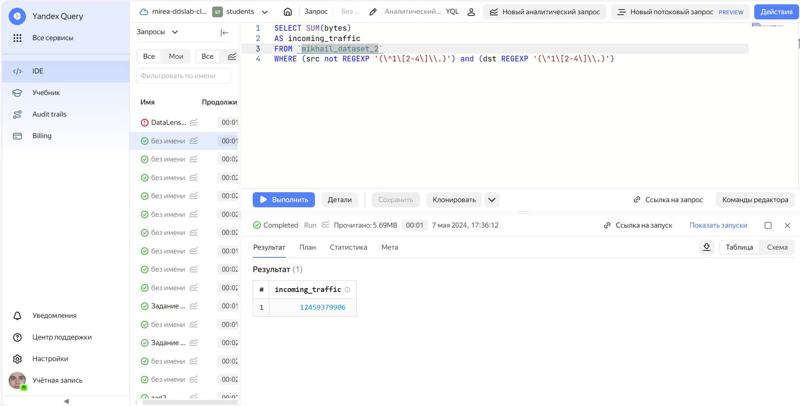

# Лабораторная работа №1.Yandex Query
Смирнов Михаил БИСО-03-20

## Цель работы

1.  Изучить возможности технологии Yandex Query для анализа
    структурированных наборов данных.

2.  Получить навыки построения аналитического пайплайна для анализа
    данных с помощью сервисов Yandex Cloud.

3.  Закрепить практические навыки использования SQL для анализа данных
    сетевой активности в сегментированной корпоративной сети.

## Общая ситуация

Вам стали доступны данные сетевой активности в корпоративной сети
компании XYZ. Данные хранятся в Yandex Object Storage. Проведите
разведочный анализ данных и ответьте на вопросы.

## Задание

Используя сервис Yandex Query настроить доступ к данным, хранящимся в
сервисе хранения данных Yandex Object Storage. При помощи
соответствующих SQL запросов ответить на вопросы.

## Ход работы

### 1. Проверка доступности данных в Yandex Object Storage

1\. Проверим доступность данных (файл yaqry_dataset.pqt) в бакете
arrow-datasets S3 хранилища Yandex Object Storage. Проверить можно
просто перейдя по правильно сконструированному URL в браузере.

    <https://storage.yandexcloud.net/arrow-datasets/yaqry_dataset.pqt>

### 2. Подключить бакет как источник данных для Yandex Query

1\. Создадим соединение для бакета в S3 хранилище.

2\. Заполним поля с учетом допустимых символов, выберем тип
аутентификации - публичный. Вводим имя бакета в соответствующее поле и
сохраняем.



3\. Теперь, после создания соединения, укажем объект, который будет
использоваться в качестве источника данных. Для этого нужно сделать
привязку данных.



4\. Опишем состав и формат входных данных.



5\. Попробуем сделать аналитический запрос и посмотреть результат.



### Анализ

1\. Известно, что IP адреса внутренней сети начинаются с октетов,
принадлежащих интервалу \[12-14\]. Определим количество хостов
внутренней сети, представленных в датасете.



2\. Определим суммарный объем исходящего трафика


``` r
sprintf("Код для получения всех чёрточек на checklab")
```

    [1] "Код для получения всех чёрточек на checklab"

3\. Определите суммарный объем входящего трафика

 \## Вывод

В ходе работы мы закрепили практические навыки использования SQL для
анализа данных сетевой активности в сегментированной корпоративной сети
и получили навыки построения аналитического пайплайна для анализа
данных.
