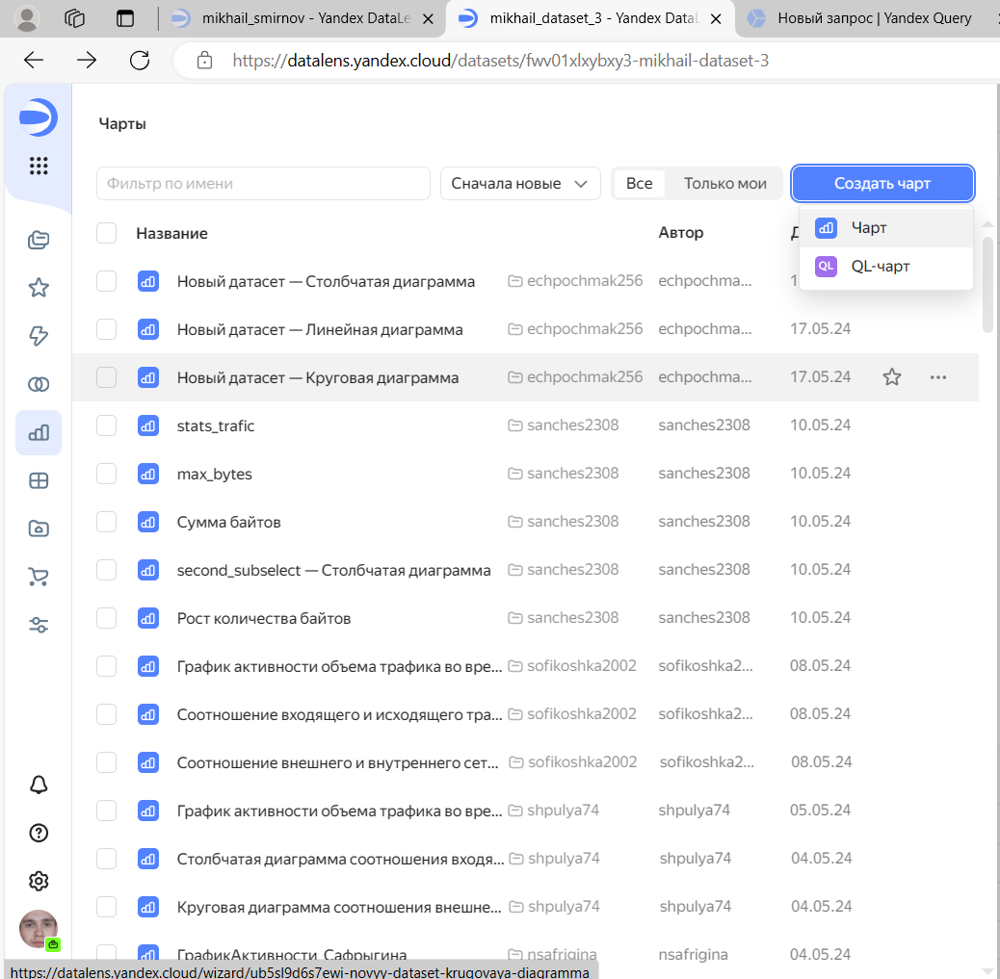

# Лабораторная работа №2.Yandex DataLens
Смирнов Михаил БИСО-03-20

## Результат работы

ссылка на дашборд:

## Цель работы

1\. Изучить возможности технологии Yandex DataLens для визуального
анализа структурированных наборов данных.

2\. Получить навыки визуализации данных для последующего анализа с
помощью сервисов Yandex Cloud.

3\. Получить навыки создания решений мониторинга/SIEM на базе облачных
продуктов и открытых программных решений.

4\. Закрепить практические навыки использования SQL для анализа данных
сетевой активности в сегментированной корпоративной сети.

## Общая ситуация

Вы продолжаете развитие своих решений, выполненных в ходе практической
работы №1.

Для понимания сетевой обстановки и принятия решений по управлению
информационной безопасностью Вам необходимо визуально представить
результаты анализа информации, выполненной в YandexQuery с помощью
продукта DataLens. Конкретнее – serverless решение в облаке YandexCloud.

Как и прежде, у Вас есть данные сетевой активности в корпоративной сети
компании XYZ. Данные хранятся в Yandex Object Storage. Вы провели
разведочный анализ данных и имеете представление о структуре данных.

## Задание

Используя сервис Yandex DataLens настроить доступ к результатам Yandex
Query, полученным в ходе выполнения практической работы №1, и визуально
представить результаты анализа данных.

## Задачи

1\. Представить в виде круговой диаграммы соотношение внешнего и
внутреннего сетевого трафика.

2\. Представить в виде столбчатой диаграммы соотношение входящего и
исходящего трафика из внутреннего сетвого сегмента.

3\. Построить график активности (линейная диаграмма) объема трафика во
времени.

4\. Все построенные графики вывести в виде единого дашборда в Yandex
DataLens.

## Ход работы

### 1. Настроить подключение к Yandex Query из DataLens

1\. Перейдём в соответствующий сервис – https://datalens.yandex.ru/.


2\. Выберем “Подключения” – “Создать новое подключение”. 3. Выберем в
разделе “Файлы и сервисы” Yandex Query.


4\. Настроим и проверим подключение.


### 2. Создать из запроса YandexQuery датасет DataLens.

Перетащите из левой колонки результаты доступных запросов как датасет в
правую часть экрвна. Внизу доступен предпросмотр датасета.


### 3. Сделать нужные графики и диаграммы.

Выбираем “Чарты – Создать чарт - Чарт”.



1\. Представим в виде круговой диаграммы соотношение внешнего и
внутреннего сетевого трафика.


2\. Представим в виде столбчатой диаграммы соотношение входящего и
исходящего трафика из внутреннего сетевого сегмента.


3\. Построим график активности (линейная диаграмма) объема трафика во
времени.


4\. Все построенные графики выведем в виде единого дашборда в Yandex
DataLens.


## Оценка результатов

``` r
sprintf("Код для получения всех чёрточек на checklab")
```

    [1] "Код для получения всех чёрточек на checklab"

## Вывод

В данной работе мы смогли закрепить практические навыки использования
SQL для анализа данных сетевой активности в сегментированной
корпоративной сети и получил навыки визуализации данных для последующего
анализа с помощью сервисов Yandex Cloud.
